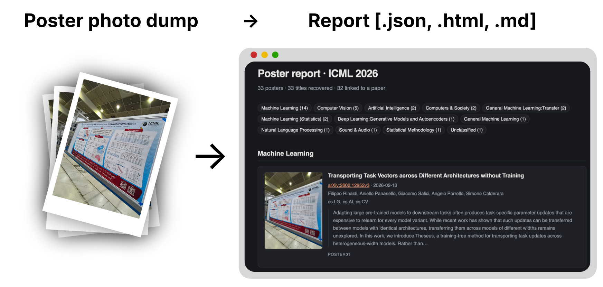

# Conference poster declutterer



Point it at a folder of poster photographs from a conference. It reads the title
off each photo, finds the paper in a scholarly index, and writes a report grouped
by subfield — alongside a tidy copy of every photo, renamed and compressed.

No dependencies: stdlib Python 3.9+, macOS Vision for OCR. The LLM is optional
and off by default.

```bash
python3 -m posterdeclutter run ~/Pictures/neurips-posters -o ./report
open ./report/report.html
```

## How it decides things

Everything on the default path is deterministic — nothing is asked of a model.

1. **OCR** — Apple's Vision framework (a small Swift helper, compiled once and
   cached). Vision returns a bounding box per line, which is what makes step 2
   possible. `--ocr tesseract` and `--ocr sidecar` (hand-written `.txt`
   transcripts next to each image) are the alternatives.
2. **Title** — posters have a strong visual grammar: the title is the largest
   text, near the top, 2–30 words, and is not an email, affiliation, section
   heading, figure label, or author list. Lines of similar size that sit close
   together merge into one block, blocks are scored, the best one wins.
   `posterdeclutter ocr <image>` shows the ranked candidates and why.
3. **Lookup** — see below.
4. **Subfield** — the arXiv primary category if there is one, else the topic the
   matched paper carries in its index, else keyword rules over the OCR text,
   else `Unclassified`, honestly.

## Sources

`--sources` takes a comma-separated list, tried in order; the first match above
the threshold wins. Default: `arxiv,openalex`.

| Source | Covers | Notes |
|---|---|---|
| `arxiv` | preprints | Author-declared categories, so its subject labels are the ones to trust |
| `openalex` | ~everything with a DOI | Free, no key. Also supplies a topic used for clustering |
| `crossref` | the DOI registry | Best for published proceedings and journal papers |
| `llm` | whatever the model recognises | Proposes an identifier only — see below |

**Google Scholar is deliberately absent**: it has no API and blocks automated
access behind CAPTCHAs, so anything built on it would break and would violate
their terms. OpenAlex and Crossref are the open equivalents.

Give `--mailto you@example.com` to join the faster OpenAlex/Crossref "polite
pools". Nothing else is sent.

**How a match is accepted.** An arXiv ID or DOI printed on the poster wins
outright — but only if the fetched paper's title agrees with the one read off the
poster. A poster that *cites* a preprint also has an arXiv ID on it, and that ID
is not the poster's own paper; those are skipped with a note. Otherwise the title
is searched and results are re-ranked by token-F1 agreement, accepted only above
`--threshold` (default 0.72). Titles shorter than four words face a higher bar,
because "Random Forests" agrees 0.80 with "Neural Random Forests" — which is a
different paper.

## Redoing part of the work

Two caches are kept apart, so improving the research never means paying for the
OCR again:

```bash
# first pass
python3 -m posterdeclutter run ./photos -o ./report --sources arxiv

# same recognised text, new sources, fresh queries
python3 -m posterdeclutter run ./photos -o ./report --redo research \
        --sources arxiv,openalex,crossref --refresh-web
```

| Flag | |
|---|---|
| `--redo none` | default; resume, skipping posters already done |
| `--redo research` | keep the cached OCR text, redo titles, lookups and clustering |
| `--redo all` | re-OCR as well (`--fresh` is an alias) |
| `--refresh-web` | drop cached lookup responses so queries really hit the network |
| `--offline` | never touch the network; use only what is cached |

A photo that changed on disk is re-recognised regardless — the OCR cache is keyed
by path, size and mtime.

## Output

```
report/
├── report.html          the posters, clustered by subfield, light+dark
├── report.md            same content as Markdown
├── report.json          every field, including all the provenance
├── unmatched.csv        the posters with no paper — fill in links, then --merge
├── posters/             the photos the report shows: compressed, renamed
│   ├── poster01.jpg
│   └── poster02.jpg
└── cache/
    ├── lines/           recognised text + geometry, per image
    ├── web/             every HTTP response, by URL
    └── posters.json     the finished records
```

The report tells you what the poster was, not how the tool got there: no match
scores, no "found via crossref", no confidences. All of that is kept — it is in
`report.json`, and `--verbose` narrates it live.

### The poster images

Every poster gets a number — `poster01`, `poster02` — and that is what its file
in `posters/` is called. The report shows those images directly: there are no
thumbnails to keep in step, and no `IMG_4417.jpg` anywhere in the folder.

They are compressed on the way in, gently: 1800px wide at quality 85 by default,
which takes a 4 MB phone photo to something under a megabyte while leaving the
small print readable. Both ends are yours to set:

```bash
# lighter page, for a lot of posters
python3 -m posterdeclutter run ./photos -o ./report --image-width 1000 --image-quality 75
# barely touched: original size, near-lossless
python3 -m posterdeclutter run ./photos -o ./report --image-width 0 --image-quality 100
```

`--images files` (the default) writes them into `posters/` and links them
relatively, so the folder can be moved or sent on and still render; `--images
embed` inlines them and leaves nothing beside the page; `--images none` leaves
them out. The paths in `report.json`, `report.md` and `report.html` are all the
same relative ones — nothing points into your Photos folder.

Images are made with `sips`, which ships with macOS; without it the report links
the original photos where they lie.

## Re-rendering a report

The Markdown and HTML pages are derived data: everything they show lives in
`report.json`. So you can rebuild them at any time — after a `--merge`, after
editing records by hand, or just to change `--conference` — without re-running
the OCR or a single lookup:

```bash
python3 -m posterdeclutter report ./report/report.json
# same thing, since a folder is accepted too:
python3 -m posterdeclutter report ./report --conference "ICML 2026"
# somewhere else entirely:
python3 -m posterdeclutter report ./report/report.json -o ./site
```

Because `report.json` points at `posters/poster01.jpg` and not at your camera
roll, a re-render works from the report folder alone — after it has been moved,
copied to another machine, or emailed to a co-author, and even if the original
photos are long gone. `--images` and the compression flags apply as usual, so
this is also how you produce a lighter or a fully embedded copy to publish:

```bash
python3 -m posterdeclutter report ./report -o ./site --images embed --image-width 1200
```

## Filling the gaps by hand

Some posters will not be found — the paper is not indexed, the photo is blurred,
the title is a pun. Every run writes `unmatched.csv` listing exactly those:

```csv
image,title,link,subfield,note
IMG_0421.jpg,An Ethnography of Poster Sessions,,,
IMG_0605.jpg,,,,no text recognised - is this a poster photo?
```

Paste a link into the `link` column — an arXiv URL, a DOI, an OpenAlex ID, a bare
`2401.12345`, or any URL at all — and hand it back:

```bash
python3 -m posterdeclutter run ./photos -o ./report --merge ./report/unmatched.csv
```

Recognised identifiers are looked up and fill in authors, venue, abstract and
subfield like any other match. Any other URL is analysed too: pages that ship
citation metadata — CVF Open Access, ACL Anthology, most publisher landing
pages — hand over their title, authors, keywords and venue, and a CVF paper
PDF is read through its HTML abstract page. The merged poster leaves
`unmatched.csv` and its "Paper not found" entry in the report is replaced by
the real thing. A link that yields nothing (a lab page, an unreadable PDF) is
kept exactly as you gave it, so nothing is lost. You can also correct `title`
— a corrected title is searched again, which is often all it takes — or set
`subfield` to override the clustering, or leave a `note`.

Manual rows win over everything, and skip the title-agreement check: you looked
at the poster and the tool did not. They are saved with the rest of the state, so
later runs keep them without `--merge`. Each run rewrites `unmatched.csv` with
only what is *still* missing, so the file shrinks as you work through it.

## Other options worth knowing

| Flag | |
|---|---|
| `--merge <csv>` | apply manual links (see above) |
| `--images files\|embed\|none` | poster images in the HTML report |
| `--image-width 1800`, `--image-quality 85` | how hard to squeeze them (`--image-width 0` keeps the original size) |
| `--conference "NeurIPS 2026"` | title for the report header |
| `--threshold 0.72` | how sure a title match must be |
| `--llm off\|api\|claude-cli\|codex-cli` | see below |
| `-v`, `--verbose` | explain every decision — see below |
| `-q`, `--quiet` | warnings only |
| `--no-recursive` | |

## Watching it work

`--verbose` explains every decision on stderr, so stdout stays parseable:

```
[1/5] IMG_0001.jpg
  title: "Deep Sets for Jet Flavour Tagging at the LHC" (score 6.20)
    runner-up 2.65  The neural network is trained on simulated ATLAS collider events
    identifiers on the poster: 2401.12345
    GET     http://export.arxiv.org/api/query?id_list=2401.12345&max_results=1 (181ms, 3.0kB)
    arXiv:2401.12345 resolves to 'Distributionally Robust Receive Combining' - disagrees (0.00), treating as a citation
    GET     https://api.crossref.org/works?query.bibliographic=Deep+Sets+for+Jet… (901ms, 7.8kB)
    crossref: 5 candidate(s), need 0.72
        skip 0.63  Jet flavour tagging for the ATLAS Experiment
        skip 0.53  Jet-Flavour Tagging at FCC-ee
    no source cleared 0.72 (best 0.63)
  subfield: High Energy Physics - Experiment (via keywords, 0.87) - lhc, atlas, collider
  done in 8.1s
```

It shows which title candidates lost and by how much, every query with its timing
and whether it came from cache, each candidate's agreement score against the
acceptance bar, why an identifier was taken or treated as a citation, and — at the
end — a breakdown by match source, by how each subfield was decided, the cluster
sizes, and every poster carrying a note.

`-q` prints warnings only. `posterdeclutter ocr <image> -v` additionally dumps the
per-line geometry the title heuristic reasons over.

## The optional LLM

**One request per run, never one per poster.** Every deterministic pass finishes
first; whatever is still missing across the whole batch goes into a single
request. A run over 300 posters costs one call, and a run where the rules
resolved everything costs none.

It is asked for at most three things, and any answer that does not parse is
discarded:

- a **title**, for posters where the heuristic found none;
- a **subfield**, where nothing else fired;
- with `--sources llm`, an **identifier** — which it only ever *proposes*. The ID
  is fetched from a real index and must agree with the poster title, so a
  hallucinated one cannot reach the report; it is discarded with a note saying
  why.

A supplied title is then searched through the normal sources, deterministically —
so "the model read the title, the index found the paper" costs no extra call.

```bash
--llm claude-cli    # runs `claude -p` locally — uses your existing session
--llm codex-cli     # runs `codex exec`
--llm api           # Anthropic Messages API, needs ANTHROPIC_API_KEY (--model to change model)
```

The reply is one JSON object per poster; unparseable lines are skipped rather
than guessed at, so a partly mangled reply still yields the answers that came
back cleanly. Per-poster OCR excerpts shrink as the batch grows, keeping the
single prompt bounded. `--llm api` uses the `anthropic` SDK if it happens to be
installed and plain `urllib` otherwise, so it stays dependency-free either way.

## Tests

Offline, no network, no model. OCR comes from fixture transcripts and every
lookup response from fixture files seeded into the HTTP cache.

```bash
python3 -m unittest discover -s tests -t . -v
```

## Requirements

- macOS with Xcode command line tools for the default Vision backend
  (`xcode-select --install`). The Swift helper is compiled on first use into
  `<out>/cache/ocr/`.
- Otherwise: `brew install tesseract` and `--ocr tesseract`.
- HEIC works with Vision; tesseract needs JPEG/PNG.
